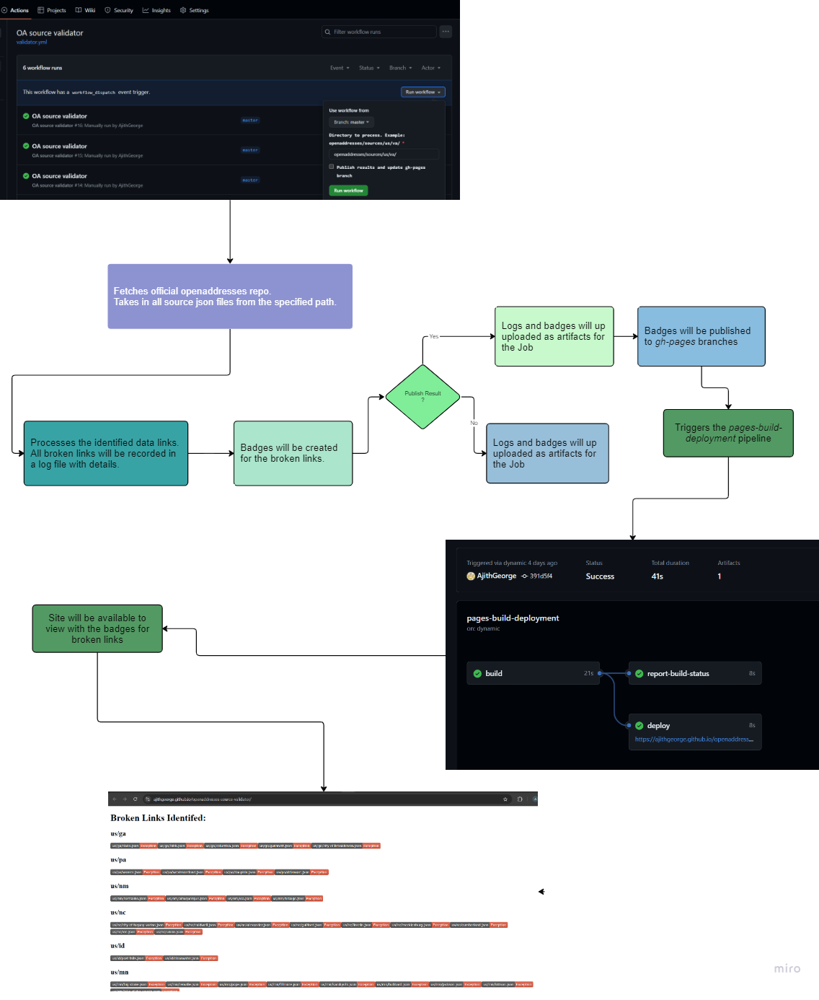

# openaddresses-source-validator
To identify broken sources in OpenAddresses sources

The goal is to create a utility that programmatically identifies broken data sources within OA sources. Given the large volume of data sources, manual verification is impractical. This project aims to automatically detect broken sources from JSON files and publish the results on a [github page](https://ajithgeorge.github.io/openaddresses-source-validator/).

Currently the same is set up as a [github workflow](https://github.com/AjithGeorge/openaddresses-source-validator/actions/workflows/validator.yml)

The [github page]((https://ajithgeorge.github.io/openaddresses-source-validator/)
) is for convenience, broken sources will be logged and available as an artifact of the workflow.

The GitHub page provides a quick way to review the broken sources.

## OA Source Validator Workflow
### Inputs

- **root_directory**: Directory to process (e.g., `openaddresses/sources/us/va/`). Any valid source directory available in openaddresses repo should be working here. The same can be triggered for the whole of US as `openaddresses/sources/us/`
- **publish_results**: Boolean to determine if results should be published to `gh-pages`. False- will process the sources and logs will be generated, but won't be published.

This workflow is manually triggered and helps in managing and publishing results based on processed data.

A simple ovierview of the flow chart is as:

 